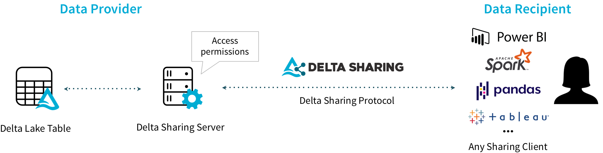

<div align="center">
  
</div>

# Delta Sharing: An Open Protocol for Secure Data Sharing

[](https://github.com/delta-io/delta-sharing/actions/workflows/build-and-test.yml)
[](https://github.com/delta-io/delta-sharing/blob/main/LICENSE.txt)
[](https://pypi.org/project/delta-sharing/)

[Delta Sharing](https://delta.io/sharing) is an open protocol for secure real-time exchange of large datasets, which enables organizations to share data in real time regardless of which computing platforms they use. It is a simple [REST protocol](PROTOCOL.md) that securely shares access to part of a cloud dataset and leverages modern cloud storage systems, such as S3, ADLS, or GCS, to reliably transfer data.

With Delta Sharing, a user accessing shared data can directly connect to it through pandas, Tableau, Apache Spark, Rust, or other systems that support the open protocol, without having to deploy a specific compute platform first. Data providers can share a dataset once to reach a broad range of consumers, while consumers can begin using the data in minutes.

<p align="center">
  
</p>

This repo includes the following components:

- Delta Sharing [protocol specification](PROTOCOL.md).
- Python Connector: A Python library that implements the Delta Sharing Protocol to read shared tables as [pandas](https://pandas.pydata.org/) DataFrame or [Apache Spark](http://spark.apache.org/) DataFrames.
- [Apache Spark](http://spark.apache.org/) Connector: An Apache Spark connector that implements the Delta Sharing Protocol to read shared tables from a Delta Sharing Server. The tables can then be accessed in SQL, Python, Java, Scala, or R.
- Delta Sharing Server: A reference implementation server for the Delta Sharing Protocol for development purposes. Users can deploy this server to share existing tables in Delta Lake and Apache Parquet format on modern cloud storage systems.


# Python Connector

The Delta Sharing Python Connector is a Python library that implements the [Delta Sharing Protocol](PROTOCOL.md) to read tables from a Delta Sharing Server. You can load shared tables as a [pandas](https://pandas.pydata.org/) DataFrame, or as an [Apache Spark](http://spark.apache.org/) DataFrame if running in PySpark with the Apache Spark Connector installed.

## System Requirements

Python 3.6+

## Installation

```
pip install delta-sharing
```

If you are using [Databricks Runtime](https://docs.databricks.com/runtime/dbr.html), you can follow [Databricks Libraries doc](https://docs.databricks.com/libraries/index.html) to install the library on your clusters.

## Accessing Shared Data

The connector accesses shared tables based on [profile files](PROTOCOL.md#profile-file-format), which are JSON files containing a user's credentials to access a Delta Sharing Server. We have several ways to get started:

- Download the profile file to access an open, example Delta Sharing Server that we're hosting [here](https://databricks-datasets-oregon.s3-us-west-2.amazonaws.com/delta-sharing/share/open-datasets.share). You can try the connectors with this sample data.
- Start your own [Delta Sharing Server](#delta-sharing-server) and create your own profile file following [profile file format](PROTOCOL.md#profile-file-format) to connect to this server.
- Download a profile file from your data provider.

## Quick Start

After you save the profile file, you can use it in the connector to access shared tables.

```python
import delta_sharing

# Point to the profile file. It can be a file on the local file system or a file on a remote storage.
profile_file = "<profile-file-path>"

# Create a SharingClient.
client = delta_sharing.SharingClient(profile_file)

# List all shared tables.
client.list_all_tables()

# Create a url to access a shared table.
# A table path is the profile file path following with `#` and the fully qualified name of a table 
# (`<share-name>.<schema-name>.<table-name>`).
table_url = profile_file + "#<share-name>.<schema-name>.<table-name>"

# Fetch 10 rows from a table and convert it to a Pandas DataFrame. This can be used to read sample data 
# from a table that cannot fit in the memory.
delta_sharing.load_as_pandas(table_url, limit=10)

# Load a table as a Pandas DataFrame. This can be used to process tables that can fit in the memory.
delta_sharing.load_as_pandas(table_url)

# If the code is running with PySpark, you can use `load_as_spark` to load the table as a Spark DataFrame.
delta_sharing.load_as_spark(table_url)
```

You can try this by running our [examples](examples/README.md) with the open, example Delta Sharing Server.

### Details on Profile Paths

- The profile file path for `SharingClient` and `load_as_pandas` can be any URL supported by [FSSPEC](https://filesystem-spec.readthedocs.io/en/latest/index.html) (such as `s3a://my_bucket/my/profile/file`). If you are using [Databricks File System](https://docs.databricks.com/data/databricks-file-system.html), you can also [preface the path with `/dbfs/`](https://docs.databricks.com/data/databricks-file-system.html#dbfs-and-local-driver-node-paths) to access the profile file as if it were a local file.  
- The profile file path for `load_as_spark` can be any URL supported by Hadoop FileSystem (such as `s3a://my_bucket/my/profile/file`).
- A table path is the profile file path following with `#` and the fully qualified name of a table (`<share-name>.<schema-name>.<table-name>`).

# Apache Spark Connector

The Apache Spark Connector implements the [Delta Sharing Protocol](PROTOCOL.md) to read shared tables from a Delta Sharing Server. It can be used in SQL, Python, Java, Scala and R.

## System Requirements

- Java 8+
- Scala 2.12.x
- Apache Spark 3+ or [Databricks Runtime](https://docs.databricks.com/runtime/dbr.html) 7+

## Accessing Shared Data

The connector loads user credentials from profile files. Please see [Download the share profile file](#download-the-share-profile-file) to download a profile file for our example server or for your own data sharing server.

## Configuring Apache Spark

You can set up Apache Spark to load the Delta Sharing connector in the following two ways:

- Run interactively: Start the Spark shell (Scala or Python) with the Delta Sharing connector and run the code snippets interactively in the shell.
- Run as a project: Set up a Maven or SBT project (Scala or Java) with the Delta Sharing connector, copy the code snippets into a source file, and run the project.

If you are using [Databricks Runtime](https://docs.databricks.com/runtime/dbr.html), you can skip this section and follow [Databricks Libraries doc](https://docs.databricks.com/libraries/index.html) to install the connector on your clusters.

### Set up an interactive shell

To use Delta Sharing connector interactively within the Spark’s Scala/Python shell, you can launch the shells as follows.

#### PySpark shell

```
pyspark --packages io.delta:delta-sharing-spark_2.12:0.4.0
```

#### Scala Shell

```
bin/spark-shell --packages io.delta:delta-sharing-spark_2.12:0.4.0
```

### Set up a standalone project

If you want to build a Java/Scala project using Delta Sharing connector from Maven Central Repository, you can use the following Maven coordinates.

#### Maven

You include Delta Sharing connector in your Maven project by adding it as a dependency in your POM file. Delta Sharing connector is compiled with Scala 2.12.

```xml
<dependency>
  <groupId>io.delta</groupId>
  <artifactId>delta-sharing-spark_2.12</artifactId>
  <version>0.4.0</version>
</dependency>
```

#### SBT

You include Delta Sharing connector in your SBT project by adding the following line to your `build.sbt` file:

```scala
libraryDependencies += "io.delta" %% "delta-sharing-spark" % "0.4.0"
```

## Quick Start

After you save the profile file and launch Spark with the connector library, you can access shared tables using any language.

### SQL
```sql
-- A table path is the profile file path following with `#` and the fully qualified name 
-- of a table (`<share-name>.<schema-name>.<table-name>`).
CREATE TABLE mytable USING deltaSharing LOCATION '<profile-file-path>#<share-name>.<schema-name>.<table-name>';
SELECT * FROM mytable;
```

### Python

```python
# A table path is the profile file path following with `#` and the fully qualified name 
# of a table (`<share-name>.<schema-name>.<table-name>`).
table_path = "<profile-file-path>#<share-name>.<schema-name>.<table-name>"
df = spark.read.format("deltaSharing").load(table_path)
```

### Scala

```scala
// A table path is the profile file path following with `#` and the fully qualified name 
// of a table (`<share-name>.<schema-name>.<table-name>`).
val tablePath = "<profile-file-path>#<share-name>.<schema-name>.<table-name>"
val df = spark.read.format("deltaSharing").load(tablePath)
```

### Java

```java
// A table path is the profile file path following with `#` and the fully qualified name 
// of a table (`<share-name>.<schema-name>.<table-name>`).
String tablePath = "<profile-file-path>#<share-name>.<schema-name>.<table-name>";
Dataset<Row> df = spark.read.format("deltaSharing").load(tablePath);
```

### R
```r
# A table path is the profile file path following with `#` and the fully qualified name 
# of a table (`<share-name>.<schema-name>.<table-name>`).
table_path <- "<profile-file-path>#<share-name>.<schema-name>.<table-name>"
df <- read.df(table_path, "deltaSharing")
```

You can try this by running our [examples](examples/README.md) with the open, example Delta Sharing Server.

### Table paths

- A profile file path can be any URL supported by Hadoop FileSystem (such as `s3a://my_bucket/my/profile/file`).
- A table path is the profile file path following with `#` and the fully qualified name of a table (`<share-name>.<schema-name>.<table-name>`).

# Delta Sharing Reference Server

The Delta Sharing Reference Server is a reference implementation server for the [Delta Sharing Protocol](PROTOCOL.md). This can be used to set up a small service to test your own connector that implements the [Delta Sharing Protocol](PROTOCOL.md). Please note that this is not a completed implementation of secure web server. We highly recommend you to put this behind a secure proxy if you would like to expose it to public.

Some vendors offer managed services for Delta Sharing too (for example, [Databricks](https://databricks.com/product/delta-sharing)). Please refer to your vendor's website for how to set up sharing there. Vendors that are interested in being listed as a service provider should open an issue on GitHub to be added to this README and our project's website.

Here are the steps to setup the reference server to share your own data.

## Get the pre-built package

Download the pre-built package `delta-sharing-server-x.y.z.zip` from [GitHub Releases](https://github.com/delta-io/delta-sharing/releases).

## Server configuration and adding Shared Data

- Unpack the pre-built package and copy the server config template file `conf/delta-sharing-server.yaml.template` to create your own server yaml file, such as `conf/delta-sharing-server.yaml`.
- Make changes to your yaml file. You may also need to update some server configs for special requirements.
- To add Shared Data, add reference to Delta Lake tables you would like to share from this server in this config file.

## Config the server to access tables on cloud storage

We support sharing Delta Lake tables on S3, Azure Blob Storage and Azure Data Lake Storage Gen2.

### S3

There are multiple ways to config the server to access S3.

#### EC2 IAM Metadata Authentication (Recommended)

Applications running in EC2 may associate an IAM role with the VM and query the [EC2 Instance Metadata Service](https://docs.aws.amazon.com/AWSEC2/latest/UserGuide/ec2-instance-metadata.html) for credentials to access S3.

#### Authenticating via the AWS Environment Variables

We support configuration via [the standard AWS environment variables](https://docs.aws.amazon.com/cli/latest/userguide/cli-chap-configure.html#cli-environment). The core environment variables are for the access key and associated secret:
```
export AWS_ACCESS_KEY_ID=my.aws.key
export AWS_SECRET_ACCESS_KEY=my.secret.key
```

#### Other S3 authentication methods

The server is using `hadooop-aws` to read S3. You can find other approaches in [hadoop-aws doc](https://hadoop.apache.org/docs/r2.10.1/hadoop-aws/tools/hadoop-aws/index.html#S3A_Authentication_methods).

### Azure Blob Storage

The server is using `hadoop-azure` to read Azure Blob Storage. Using Azure Blob Storage requires [configuration of credentials](https://hadoop.apache.org/docs/current/hadoop-azure/index.html#Configuring_Credentials). You can create a Hadoop configuration file named `core-site.xml` and add it to the server's `conf` directory. Then add the following content to the xml file:

```xml
<?xml version="1.0"?>
<?xml-stylesheet type="text/xsl" href="configuration.xsl"?>
<configuration>
  <property>
    <name>fs.azure.account.key.YOUR-ACCOUNT-NAME.blob.core.windows.net</name>
    <value>YOUR-ACCOUNT-KEY</value>
  </property>
</configuration>
```
`YOUR-ACCOUNT-NAME` is your Azure storage account and `YOUR-ACCOUNT-KEY` is your account key.

### Azure Data Lake Storage Gen2

The server is using `hadoop-azure` to read Azure Data Lake Storage Gen2. We support [the Shared Key authentication](https://hadoop.apache.org/docs/stable/hadoop-azure/abfs.html#Default:_Shared_Key). You can create a Hadoop configuration file named `core-site.xml` and add it to the server's `conf` directory. Then add the following content to the xml file:

```xml
<?xml version="1.0"?>
<?xml-stylesheet type="text/xsl" href="configuration.xsl"?>
<configuration>
  <property>
    <name>fs.azure.account.auth.type.YOUR-ACCOUNT-NAME.dfs.core.windows.net</name>
    <value>SharedKey</value>
    <description>
    </description>
  </property>
  <property>
    <name>fs.azure.account.key.YOUR-ACCOUNT-NAME.dfs.core.windows.net</name>
    <value>YOUR-ACCOUNT-KEY</value>
    <description>
    The secret password. Never share these.
    </description>
  </property>
</configuration>
```
`YOUR-ACCOUNT-NAME` is your Azure storage account and `YOUR-ACCOUNT-KEY` is your account key.

### Google Cloud Storage

We support using [Service Account](https://cloud.google.com/iam/docs/service-accounts) to read Google Cloud Storage. You can find more details in [GCP Authentication Doc](https://cloud.google.com/docs/authentication/getting-started).

To set up the Service Account credentials, you can specify the environment GOOGLE_APPLICATION_CREDENTIALS before starting the Delta Sharing Server.

```
export GOOGLE_APPLICATION_CREDENTIALS="KEY_PATH"
```

Replace `KEY_PATH` with path of the JSON file that contains your service account key.

## Authorization

The server supports a basic authorization with pre-configed bearer token. You can add the following config to your server yaml file:

```yaml
authorization:
  bearerToken: <token>
```

Then any request should send with the above token, otherwise, the server will refuse the request.

If you don't config the bearer token in the server yaml file, all requests will be accepted without authorization.

To be more secure, you recommend you to put the server behind a secure proxy such as [NGINX](https://www.nginx.com/) to set up [JWT Authentication](https://docs.nginx.com/nginx/admin-guide/security-controls/configuring-jwt-authentication/).

## Start the server

Run the following shell command:

```
bin/delta-sharing-server -- --config <the-server-config-yaml-file> 
```

`<the-server-config-yaml-file>` should be the path of the yaml file you created in the previous step. You can find options to config JVM in [sbt-native-packager](https://www.scala-sbt.org/sbt-native-packager/archetypes/java_app/index.html#start-script-options).

## Use the pre-built Docker image

You can use the pre-built docker image from https://hub.docker.com/r/deltaio/delta-sharing-server by running the following command

```
docker run -p <host-port>:<container-port> \
  --mount type=bind,source=<the-server-config-yaml-file>,target=/config/delta-sharing-server-config.yaml \
  deltaio/delta-sharing-server:0.4.0 -- --config /config/delta-sharing-server-config.yaml
```

Note that `<container-port>` should be the same as the port defined inside the config file.

## API Compatibility

The REST APIs provided by Delta Sharing Server are stable public APIs. They are defined by [Delta Sharing Protocol](PROTOCOL.md) and we will follow the entire protocol strictly.

The interfaces inside Delta Sharing Server are not public APIs. They are considered internal, and they are subject to change across minor/patch releases.

# Delta Sharing Protocol

The [Delta Sharing Protocol specification](PROTOCOL.md) details the protocol.

# Building this Project

## Python Connector

To execute tests, run

```
python/dev/pytest
```

To install in develop mode, run

```
cd python/
pip install -e .
```

To install locally, run

```
cd python/
pip install .
```

To generate a wheel file, run

```
cd python/
python setup.py sdist bdist_wheel
```

It will generate `python/dist/delta_sharing-x.y.z-py3-none-any.whl`.

## Apache Spark Connector and Delta Sharing Server

Apache Spark Connector and Delta Sharing Server are compiled using [SBT](https://www.scala-sbt.org/1.x/docs/Command-Line-Reference.html).

To compile, run

```
build/sbt compile
```

To execute tests, run

```
build/sbt test
```

To generate the Apache Spark Connector, run

```
build/sbt spark/package
```

It will generate `spark/target/scala-2.12/delta-sharing-spark_2.12-x.y.z.jar`.

To generate the pre-built Delta Sharing Server package, run

```
build/sbt server/universal:packageBin
```

It will generate `server/target/universal/delta-sharing-server-x.y.z.zip`.

To build the Docker image for Delta Sharing Server, run

```
build/sbt server/docker:publishLocal
```

This will build a Docker image tagged `delta-sharing-server:x.y.z`, which you can run with:

```
docker run -p <host-port>:<container-port> \
  --mount type=bind,source=<the-server-config-yaml-file>,target=/config/delta-sharing-server-config.yaml \
  delta-sharing-server:x.y.z -- --config /config/delta-sharing-server-config.yaml
```

Note that `<container-port>` should be the same as the port defined inside the config file.


Refer to [SBT docs](https://www.scala-sbt.org/1.x/docs/Command-Line-Reference.html) for more commands.

# Reporting Issues

We use [GitHub Issues](https://github.com/delta-io/delta-sharing/issues) to track community reported issues. You can also [contact](#community) the community for getting answers.

# Contributing 
We welcome contributions to Delta Sharing. See our [CONTRIBUTING.md](CONTRIBUTING.md) for more details.

We also adhere to the [Delta Lake Code of Conduct](https://github.com/delta-io/delta/blob/master/CODE_OF_CONDUCT.md).

# License
[Apache License 2.0](LICENSE.txt).

# Community

We use the same community resources as the Delta Lake project:

- Public Slack Channel
  - [Register here](https://dbricks.co/delta-users-slack)
  - [Login here](https://delta-users.slack.com/)

- Public [Mailing list](https://groups.google.com/forum/#!forum/delta-users)
