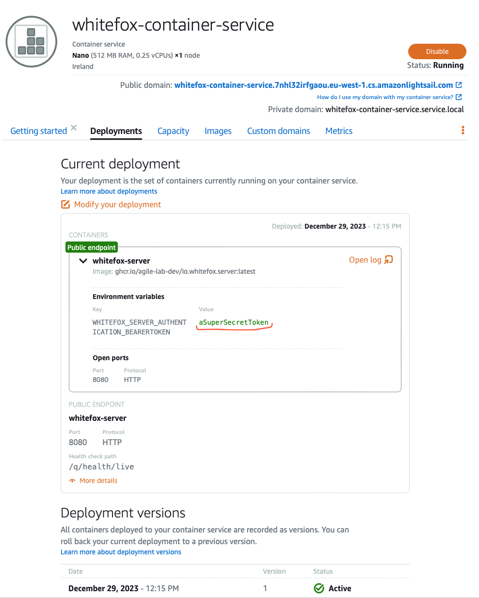

# Amazon Lightsail

[Amazon Lightsail](https://aws.amazon.com/lightsail) lets you build applications and websites fast with low-cost, 
pre-configured cloud resources.

In order to deploy a minimal and **public** setup of whitefox you'll need:

- [an AWS account](https://aws.amazon.com/free/)
- [Terraform installed locally](https://developer.hashicorp.com/terraform/install)
- 10 minutes of your time

:::warning

**This is not a production ready deployment**, but is a pretty cheap one: approximately 8$ a month.

:::

:::danger

Your secret token will be set as an environment variable of the container and will be visible to whoever
has access to the Amazon Lightsail console. 

:::

----

## Configuration

You need to configure a few things:

### AWS region

head over to `deployment/lightsail/demo.tfvars` and change the value of `region` to your preferred AWS region.

### Secret token

head over to `deployment/lightsail/demo.tfvars` and change the value of `whitefox_token` to a secret string that
you will need to provide as the bearer token to access  whitefox API.

### AWS credentials

You need to provide terraform a way to authenticate to aws, so head over [terraform docs](https://registry.terraform.io/providers/hashicorp/aws/latest/docs)
and find the way that suits your needs.

## Show time

Run:

```shell
cd deployment/lightsail
terraform init
terraform apply -var-file="demo.tfvars"
```

To verify that the deployment was successful, grab the output of the previous command, especially the `public_endpoint`
and issue the command:

```shell
curl $public_endpoint/q/health/live
```

the output should be something similar to:

```json
{
    "status": "UP",
    "checks": [
    ]
}
```

If you log into your aws lightsail account: https://lightsail.aws.amazon.com/ls/webapp/home/instances you should
see something like this:




## Wrap up

Destroy everything running:

```shell
terraform destroy -var-file="demo.tfvars"
```

:::warning

**Might not be the best idea to store terraform state locally, [evaluate to configure a different backend](https://developer.hashicorp.com/terraform/language/settings/backends/configuration).**

:::